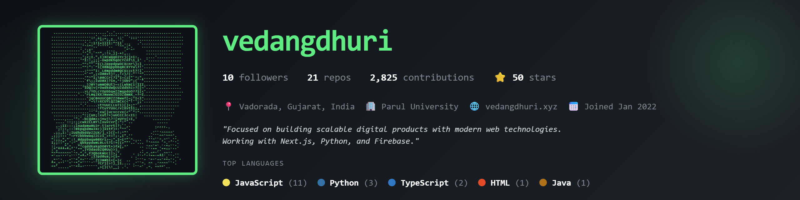

  

<h1 align="center">Hey, I'm Vedang Dhuri 👋</h1>

  <strong>Full-Stack Developer · Real-Time Systems Builder · Cloud & AI/ML Learner</strong>

  I build dependable web products where thoughtful interfaces, robust backends, and cloud infrastructure meet.
  Currently pursuing a B.Tech in Computer Science & Engineering (AI/ML) at Parul University.

  
  
  

---

## What I build

- **Real-time experiences** — interactive applications powered by event-driven architecture and live feedback loops.
- **Full-stack platforms** — maintainable products with React/Next.js frontends, Django or Node.js APIs, and practical database design.
- **Cloud-aware backends** — services designed with IAM, data protection, storage APIs, and reliable deployment in mind.

## Selected work

| Project | What it does | Stack |
| --- | --- | --- |
| [RoastRoom](https://github.com/vedangdhuri/RoastRoom) | A real-time debate arena where players are scored on logic, creativity, and humor. | React, Node.js, Socket.IO, AI |
| [Opti-Time](https://github.com/vedangdhuri/Opti-Time-69) | Constraint-based university timetable generation for batches, faculty, and conflict-free allocation. | Python, Django, REST APIs |
| [SafeCity Hub](https://github.com/vedangdhuri/SafeCity-Hub) | A role-based safety platform for incident reporting, operational tracking, and analytics. | Django, Python, Tailwind CSS |
| [vedangdhuri.io](https://github.com/vedangdhuri/vedangdhuri.io) | My interactive developer portfolio. | Next.js, TypeScript, Three.js, Framer Motion |

## Toolkit

  
   
  

## Learning in public

- Building deeper capability in **cloud architecture, AI/ML, and system design**.
- Google Cloud **Generative AI Leader** certified.
- Hands-on with Google Cloud IAM, Cloud Storage APIs, and sensitive-data protection through the **Google Cloud Arcade Facilitator Program 2026**.

## GitHub at a glance

  

  
  

<picture>
  <source media="(prefers-color-scheme: dark)" srcset="https://raw.githubusercontent.com/vedangdhuri/vedangdhuri/output/github-contribution-grid-snake-dark.svg" />
  <source media="(prefers-color-scheme: light)" srcset="https://raw.githubusercontent.com/vedangdhuri/vedangdhuri/output/github-contribution-grid-snake.svg" />
  
</picture>

  <i>Open to backend, full-stack, and cloud-focused opportunities where I can turn complex problems into useful systems.</i>

